# ÉLAN Commerce Database Architecture

## Implementation Status

The first commerce foundation is implemented in:

```text
supabase/migrations/20260613190000_core_commerce_schema.sql
supabase/migrations/20260613191000_security_and_storage.sql
supabase/migrations/20260613192000_seed_storefront.sql
supabase/migrations/20260613200000_catalog_admin_operations.sql
```

The migrations cover profiles and roles, catalog data, generic options, variants,
inventory, media metadata, boxes, homepage content, audit logging, RLS, and the
`catalog-media` Storage bucket. The current local storefront catalog is seeded
with deterministic UUIDs.

Run `npm run db:validate` to execute the full migration chain against a temporary
PostgreSQL 17 database, reapply the seed, verify expected record counts, confirm
RLS coverage, and check that anonymous users cannot read exact inventory.

Run `npm run db:types` to regenerate the typed Supabase contract directly from
that validated schema. Browser, server, and middleware clients all consume the
generated `Database` type.

The application layer now includes email/password sign-in, sign-up, confirmation,
password recovery, server-side role lookup, and protected `/admin/*` routes.
`npm run auth:verify` confirms that signed-out requests cannot render protected
admin content.

Protected administration now covers products and generated variants, categories,
collections, inventory adjustments, boxes, homepage sections and placements, and
the media library. Product and box compound writes are transactional database
functions. Homepage ordering is serialized and swapped transactionally. Media
uploads use the authenticated browser Storage session, while metadata registration
and role checks are performed server-side.

The homepage reads visible structured CMS content when the schema is available and
falls back to the existing typed mock presentation when it is not. This permits a
safe hosted migration without making the current production storefront dependent
on an unapplied schema.

The migration chain is applied to hosted Supabase project
`whmodhorpeivabfguhcm`. The hosted schema, RLS policies, deterministic seed,
transactional administration functions, and `catalog-media` bucket were verified
on June 14, 2026. The owner Auth record has the `admin` role and must complete the
emailed password-setup flow before the first interactive admin session.

## Design Goals

- Keep products separate from sellable color/size variants.
- Keep inventory and order history immutable enough for auditing.
- Let administrators manage the complete storefront without editing code.
- Let homepage sections reference products and media instead of duplicating them.
- Collect useful commerce events without storing unnecessary personal data.
- Enforce permissions in Postgres Row Level Security, not only in the UI.

## Core ER Diagram

```mermaid
erDiagram
  AUTH_USERS ||--|| PROFILES : has
  AUTH_USERS ||--o{ USER_ROLES : assigned
  AUTH_USERS ||--o{ ADDRESSES : owns
  AUTH_USERS ||--o| WISHLISTS : owns
  AUTH_USERS ||--o{ CARTS : owns
  AUTH_USERS ||--o{ ORDERS : places
  AUTH_USERS ||--o{ ADMIN_AUDIT_LOGS : performs

  CATEGORIES ||--o{ PRODUCTS : classifies
  COLLECTIONS ||--o{ PRODUCT_COLLECTIONS : groups
  PRODUCTS ||--o{ PRODUCT_COLLECTIONS : belongs_to
  OPTION_TYPES ||--o{ OPTION_VALUES : contains
  PRODUCTS ||--o{ PRODUCT_OPTION_VALUES : enables
  OPTION_VALUES ||--o{ PRODUCT_OPTION_VALUES : enabled_as
  PRODUCTS ||--o{ PRODUCT_VARIANTS : sells_as
  PRODUCT_VARIANTS ||--o{ VARIANT_OPTION_VALUES : configured_by
  OPTION_VALUES ||--o{ VARIANT_OPTION_VALUES : selected_as
  PRODUCTS ||--o{ PRODUCT_MEDIA : displays
  PRODUCT_VARIANTS ||--o{ PRODUCT_MEDIA : may_override
  MEDIA_ASSETS ||--o{ PRODUCT_MEDIA : supplies
  PRODUCT_VARIANTS ||--o{ INVENTORY_LEVELS : stocked_as

  BOXES ||--o{ BOX_ITEMS : contains
  PRODUCTS ||--o{ BOX_ITEMS : included_product

  WISHLISTS ||--o{ WISHLIST_ITEMS : contains
  PRODUCTS ||--o{ WISHLIST_ITEMS : saves
  CARTS ||--o{ CART_ITEMS : contains
  PRODUCT_VARIANTS ||--o{ CART_ITEMS : references

  ORDERS ||--o{ ORDER_ITEMS : contains
  PRODUCT_VARIANTS ||--o{ ORDER_ITEMS : originated_from
  ORDERS ||--o{ ORDER_ADDRESSES : snapshots
  ORDERS ||--o{ PAYMENTS : paid_by
  ORDERS ||--o{ FULFILLMENTS : fulfilled_by

  HOMEPAGE_SECTIONS ||--o{ HOMEPAGE_SECTION_ITEMS : contains
  PRODUCTS ||--o{ HOMEPAGE_SECTION_ITEMS : may_feature
  BOXES ||--o{ HOMEPAGE_SECTION_ITEMS : may_feature
  MEDIA_ASSETS ||--o{ HOMEPAGE_SECTION_ITEMS : may_display

  SITE_SETTINGS ||--o{ NAVIGATION_ITEMS : configures
```



## Catalog Tables

### `products`

The merchandising identity shared by all color and size combinations.

Important fields:

```text
id uuid PK
slug text UNIQUE
name text
short_description text
description text
category_id uuid FK
status draft|active|archived
base_price_tnd numeric(10,3)
composition text
fit text
care text
delivery_note text
returns_note text
is_new boolean
is_best_seller boolean
published_at timestamptz
seo_title text
seo_description text
created_at / updated_at
```

### Product options and variants

Use generic options rather than hardcoding only color and size:

```text
option_types: Color, Size
option_values: Black, Ivory, XS, S, M
product_option_values: values enabled for a product
product_variants: SKU, price override, barcode, active state
variant_option_values: links one variant to its selected values
```

This supports future options such as length or material without a schema rewrite.
Product lists should show one product with its available color swatches, not duplicate
each color as a separate product.

### `inventory_levels`

```text
id uuid PK
variant_id uuid FK
location_id uuid FK inventory_locations
stocked_quantity integer
reserved_quantity integer
low_stock_threshold integer
updated_at timestamptz
```

Available quantity is:

```text
stocked_quantity - reserved_quantity
```

Do not store inventory directly on `products`.

### `media_assets`

Metadata for files stored in Supabase Storage:

```text
id uuid PK
bucket text
object_path text UNIQUE
alt_text text
width integer
height integer
mime_type text
file_size_bytes bigint
created_by uuid FK auth.users
created_at
```

The actual image stays in Storage. Database rows reference its path and accessible
metadata. `product_media` adds ordering, role, and optional variant association.

## Homepage CMS

### `homepage_sections`

```text
id uuid PK
section_key text UNIQUE
section_type hero|product_grid|category_grid|editorial|slider|boxes|services|newsletter
eyebrow text
heading text
body text
theme light|dark|off_white
position integer
is_visible boolean
settings jsonb
updated_by uuid FK auth.users
updated_at timestamptz
```

`settings` is only for layout details that genuinely vary, such as:

```json
{
  "columns": 4,
  "mobileLayout": "horizontal",
  "imageRatio": "portrait"
}
```

Do not put product IDs or arbitrary complete page objects in `settings`.

### `homepage_section_items`

```text
id uuid PK
section_id uuid FK
product_id uuid FK nullable
box_id uuid FK nullable
media_asset_id uuid FK nullable
title_override text nullable
body_override text nullable
cta_label text nullable
cta_href text nullable
position integer
is_visible boolean
```

This table controls:

- Products shown in New Arrivals and Best Sellers
- The three hero images
- Shop-by-rhythm cards
- Curated slider cards
- Featured boxes

Only one target should normally be set per item.

## Accounts and Authorization

### `profiles`

```text
id uuid PK FK auth.users
first_name text
last_name text
phone text
avatar_path text
marketing_consent boolean
created_at / updated_at
```

### `user_roles`

```text
user_id uuid FK auth.users
role customer|editor|admin
created_by uuid FK auth.users
created_at
PRIMARY KEY (user_id, role)
```

Recommended permissions:

| Capability | Customer | Editor | Admin |
|---|---:|---:|---:|
| Read active catalog | Yes | Yes | Yes |
| Manage own account/cart/wishlist | Yes | Yes | Yes |
| Edit homepage/catalog content | No | Yes | Yes |
| Change prices/inventory | No | Optional | Yes |
| Manage staff roles | No | No | Yes |
| Delete/archive products | No | No | Yes |

Never authorize from user-editable metadata. Check protected roles through RLS or
a trusted JWT claim.

## Admin Interface

Protected route group:

```text
/admin
/admin/products
/admin/products/new
/admin/products/[id]
/admin/categories
/admin/collections
/admin/inventory
/admin/boxes
/admin/homepage
/admin/media
/admin/customers
/admin/orders
/admin/settings
/admin/audit
```

### Product editor

Tabs:

1. Basic information
2. Pricing
3. Options and variants
4. Inventory
5. Images
6. Details and care
7. SEO
8. Publishing

Required features:

- Draft, publish, archive
- Bulk variant generation from colors and sizes
- SKU and stock table
- Drag-to-reorder media
- Preview before publishing
- Duplicate product
- Validation for slug, price, image alt text, and active variants

### Homepage editor

Provide two editing paths:

1. `/admin/homepage`: full structured section editor.
2. Admin-only controls on the public homepage.

When an authenticated editor/admin views the homepage, show small controls such as:

```text
[Edit hero]
[Change images]
[Choose products]
[Reorder section]
[Hide section]
```

Implementation rules:

- Render controls only after a server-side role check.
- Buttons link to a focused admin drawer or `/admin/homepage?section=hero`.
- Save through Server Actions.
- Revalidate the homepage after a successful update.
- Never make the public section itself `contenteditable`.
- Never rely on hidden buttons for authorization.

### Media manager

- Upload to Supabase Storage
- Search by filename and alt text
- Crop/replace association without deleting historical order data
- Require alt text before publishing
- Show where each asset is used
- Prevent deleting an asset still referenced by published content

### CRUD policy

Prefer archive/status changes over destructive deletion for:

- Products
- Variants previously ordered
- Categories
- Orders
- Media referenced in historic records

Hard deletion is acceptable for unused drafts and abandoned uploads.

## Orders and Historical Accuracy

`order_items` must snapshot customer-facing details:

```text
product_name
variant_name
sku
unit_price_tnd
quantity
image_url
tax_amount
discount_amount
```

Do not render old orders only by joining the current product row. Products, names,
prices, and images can change after purchase.

## Useful Data to Collect

### First-party operational data

- Product, variant, stock, and price
- Cart and wishlist contents
- Orders, returns, payments, and fulfillment status
- Customer addresses and explicit marketing consent
- Homepage publishing and admin audit history

### Minimal behavioral events

```text
analytics_events
id uuid
anonymous_id uuid
user_id uuid nullable
session_id uuid
event_name text
product_id uuid nullable
variant_id uuid nullable
section_key text nullable
properties jsonb
created_at timestamptz
```

Initial event allowlist:

```text
product_viewed
product_added_to_cart
product_added_to_wishlist
search_submitted
filter_applied
checkout_started
order_completed
homepage_item_clicked
```

Avoid collecting:

- Keystrokes
- Precise location
- Sensitive profile attributes
- Unbounded arbitrary event names
- Raw payment card data
- Duplicate page-view data already covered by Vercel Analytics

Use an allowlist and retention policy. Aggregate or delete old anonymous events.

## RLS Summary

- Anonymous users: read active, published catalog and homepage content.
- Customers: manage only their own profile, addresses, carts, and wishlists.
- Customers: read only their own orders.
- Editors: manage catalog, media, boxes, and homepage content.
- Admins: all editor rights plus staff roles, inventory, and settings.
- Orders/payments: created or mutated only through trusted server workflows.
- Storage: public read for published catalog assets; editor/admin write.

## Indexes and Constraints

Minimum indexes:

```text
products(slug)
products(status, published_at)
products(category_id, status)
product_variants(product_id, is_active)
product_variants(sku)
inventory_levels(variant_id, location_id)
homepage_sections(position, is_visible)
homepage_section_items(section_id, position)
orders(user_id, created_at desc)
analytics_events(event_name, created_at desc)
```

Important constraints:

- Nonnegative prices and inventory quantities
- Unique SKU when present
- Unique section position per homepage section
- One active cart per user and currency
- One wishlist item per wishlist/product
- Valid order status transitions handled by server workflows

## Delivery Phases

### Phase 1

- Implemented locally: roles and profiles
- Implemented locally: catalog, variants, inventory, media, boxes
- Implemented locally: homepage CMS and storefront fallback reader
- Implemented locally: protected product, taxonomy, inventory, box, homepage,
  and media administration
- Hosted: migrations applied and first admin role assigned
- Pending: owner completes the emailed password setup and interactive CRUD smoke test
- Pending: replace remaining mock catalog reads after hosted verification

### Phase 2

- Persistent wishlist and cart
- Addresses
- Search and event tracking
- Admin audit history

### Phase 3

- Orders, payments, fulfillment, returns
- Inventory reservations
- Customer/order administration

### Phase 4

- Promotions, reviews, localized content, advanced reporting
